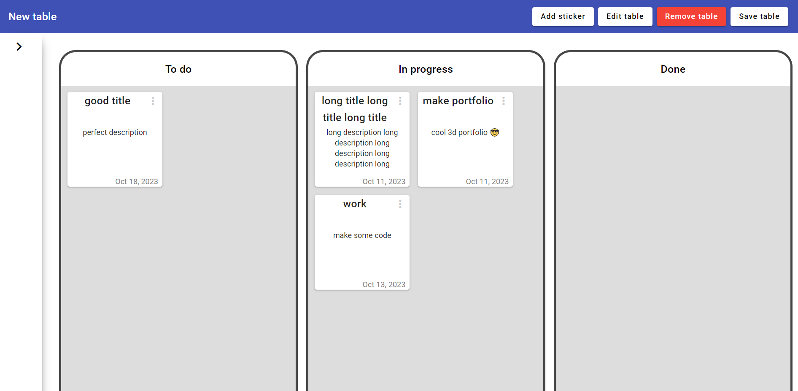
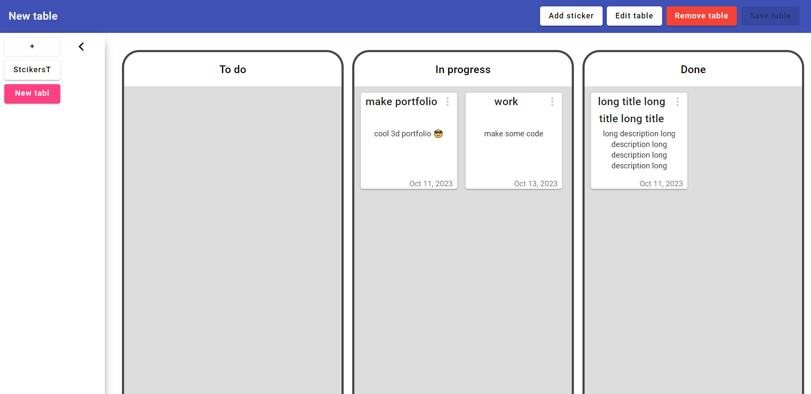
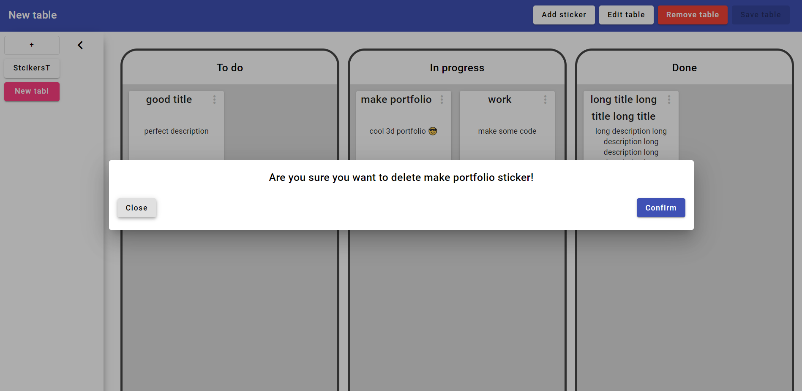
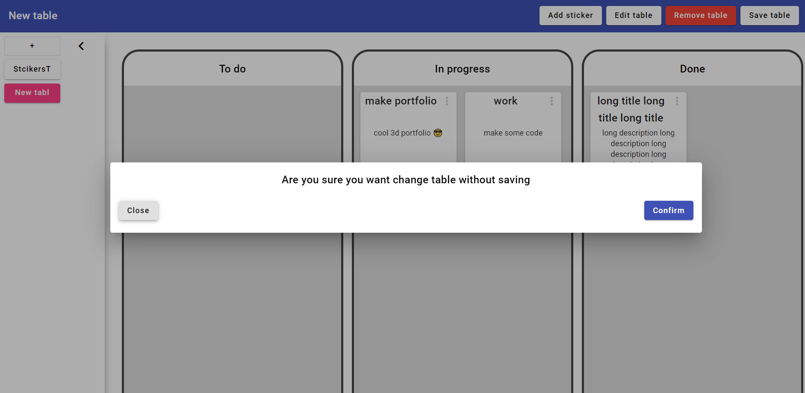

# Task Manager Project
Task Manager app with using Angular, Spring boot and PostgreSQL

## Preview of project

<h3 style="text-align: center;"">Screen of page</h3>

<h3 style="text-align: center;"">Page with opened sidebar</h3>

<h3 style="text-align: center;"">Moving sticker</h3>

<h3 style="text-align: center;"">Creating sticker dialog</h3>

<h3 style="text-align: center;"">Confirmation of deleting sticker</h3>

<h3 style="text-align: center;"">Change page without saving confirmation</h3>

<h3 style="text-align: center;"">Error handling</h3>

